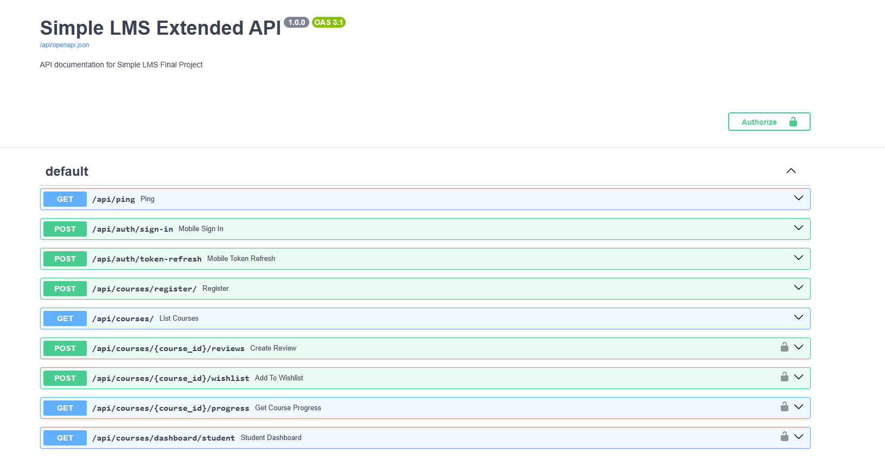
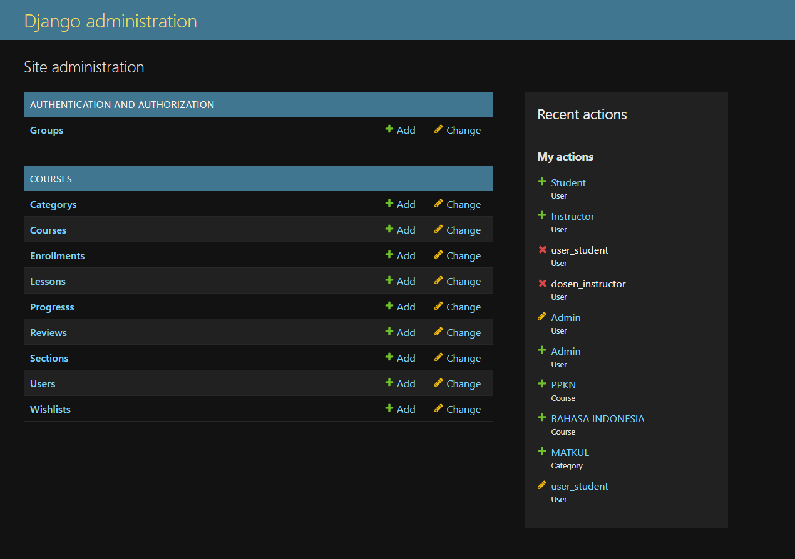
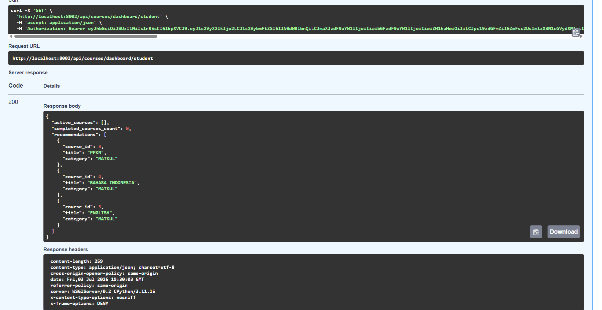

# FINAL PROJECT REPORT

## Simple LMS Extended Backend

---

## 1. Identitas

|                    |                                    |
| ------------------ | ---------------------------------- |
| **Nama**           | NABHAAN AURYSHAFA ADHIGANA         |
| **NIM**            | A11.2023.15254                     |
| **Kelas**          | A11.4618                           |
| **Mata Kuliah**    | Pemrograman Sisi Server (A11.4618) |
| **URL Repository** |                                    |

---

## 2. Deskripsi Project

Simple LMS Extended Backend adalah pengembangan lanjutan dari project **Simple Learning Management System (LMS)** yang dibuat pada tugas capstone sebelumnya. Project ini merupakan backend berbasis **Django** dan **Django Ninja** dengan database **PostgreSQL**, yang menyediakan API untuk mengelola pembelajaran online: manajemen course, enrollment, progress belajar, hingga interaksi student seperti review dan wishlist.

Pada final project ini, sistem dikembangkan lebih jauh dengan menambahkan **Paket 1 – LMS Experience**, yang berfokus pada peningkatan pengalaman student dan instructor dalam menggunakan LMS, meliputi pencarian course yang lebih fleksibel, sistem rating/review/wishlist, struktur curriculum yang lebih detail dengan progress belajar per section, serta dashboard ringkasan untuk student.

Seluruh sistem dijalankan menggunakan **Docker Compose**, menggunakan autentikasi **JWT**, dan menerapkan **role-based access control** untuk tiga peran: `admin`, `instructor`, dan `student`.

---

## 3. Fitur Dasar yang Sudah Berjalan

| Fitur                         | Keterangan                                                                              |
| ----------------------------- | --------------------------------------------------------------------------------------- |
| **Authentication (JWT)**      | Register, login, dan refresh token menggunakan JWT                                      |
| **Role-Based Access Control** | Tiga role: `admin`, `instructor`, `student` dengan hak akses berbeda pada tiap endpoint |
| **Category API**              | CRUD kategori course                                                                    |
| **Course API**                | CRUD course, terhubung dengan instructor dan category                                   |
| **Enrollment API**            | Student dapat mendaftar (enroll) ke course                                              |
| **Progress API**              | Pencatatan progress belajar student per lesson                                          |
| **Swagger / OpenAPI**         | Dokumentasi API otomatis dapat diakses melalui `/api/docs`                              |
| **Docker & Docker Compose**   | Seluruh service (web & database) berjalan melalui container                             |

---

## 4. Fitur Tambahan yang Dipilih

**Paket yang diambil: Paket 1 – LMS Experience**

| No  | Fitur                                       | Kategori                     | Poin   | Status  |
| --- | ------------------------------------------- | ---------------------------- | ------ | ------- |
| 1   | Search, filter, dan sorting course lanjutan | Course & Learning Experience | 12     | Selesai |
| 2   | Rating, review, dan wishlist course         | Course & Learning Experience | 12     | Selesai |
| 3   | Curriculum dan progress belajar detail      | Course & Learning Experience | 15     | Selesai |
| 4   | Student dashboard                           | Course & Learning Experience | 12     | Selesai |
|     | **Total Poin Fitur Tambahan**               |                              | **51** |         |

---

## 5. Penjelasan Implementasi

### 5.1 Search, Filter, dan Sorting Course Lanjutan (12 poin)

Endpoint `GET /api/courses` diperluas agar mendukung pencarian dan penyaringan course secara fleksibel melalui query parameter:

- `search` — pencarian keyword pada judul dan deskripsi course
- `category`, `instructor`, `level`, `status` — filter berdasarkan atribut course
- `sort` — pengurutan berdasarkan `newest`, `popular` (jumlah enrollment), atau `rating`

Untuk menghindari masalah N+1 query, rata-rata rating dan jumlah enrollment dihitung menggunakan `annotate()` (`Avg`, `Count`) pada query utama, bukan dengan looping manual.

### 5.2 Rating, Review, dan Wishlist Course (12 poin)

Ditambahkan dua model baru: `Review` dan `Wishlist`.

- Student hanya dapat memberi review pada course yang **sudah diikuti (enrolled)** — divalidasi di service layer sebelum data disimpan.
- Satu student hanya dapat memiliki satu review per course (`unique_together`); submit ulang akan memperbarui review yang sudah ada, bukan membuat duplikat.
- Wishlist bekerja sebagai toggle: request yang sama akan menambahkan course ke wishlist jika belum ada, atau menghapusnya jika sudah ada.
- Rata-rata rating course ditampilkan pada endpoint list dan detail course.

### 5.3 Curriculum dan Progress Belajar Detail (15 poin)

Struktur course diperluas dengan model `Section`, di mana setiap course dapat memiliki banyak section, dan setiap section dapat memiliki banyak lesson. Progress belajar dicatat per lesson melalui model `LessonProgress`, kemudian dihitung menjadi:

- Persentase progress per **section**
- Persentase progress keseluruhan per **course**

Endpoint `GET /api/courses/{id}/curriculum` mengembalikan struktur lengkap section beserta lesson dan status penyelesaiannya untuk student yang bersangkutan, sedangkan `POST /api/lessons/{id}/complete` digunakan untuk menandai satu lesson selesai.

### 5.4 Student Dashboard (12 poin)

Endpoint `GET /api/dashboard/student` menggabungkan data dari beberapa sumber untuk memberikan ringkasan kepada student:

- Jumlah course yang sedang diikuti dan yang sudah selesai
- Daftar course aktif beserta persentase progress masing-masing
- Rekomendasi course sederhana, diambil dari kategori course yang sudah pernah diikuti student namun belum diambil

---

## 6. Cara Menjalankan Project

### Prasyarat

- Docker & Docker Compose terinstal

### Langkah-langkah

```bash
# 1. Clone repository
git clone <url-repo-anda>
cd simple-lms-extended-backend

# 2. Siapkan environment variable
cp .env.example .env

# 3. Build dan jalankan container
docker compose up -d --build

# 4. Jalankan migration
docker compose exec web python manage.py migrate

# 5. (Opsional) buat superuser
docker compose exec web python manage.py createsuperuser

# 6. Load data demo/seed
docker compose exec web python manage.py seed_demo_data
```

Aplikasi dapat diakses melalui:

- API: `http://localhost:8000/api/`
- Swagger docs: `http://localhost:8000/api/docs`
- Django Admin: `http://localhost:8000/admin`

---

## 7. Akun Demo

| Role       | Email                 | Password           |
| ---------- | --------------------- | ------------------ |
| Admin      | `admin@lms.test`      | `Admin12345!`      |
| Instructor | `instructor@lms.test` | `Instruktur12345!` |
| Student    | `student@lms.test`    | `Students12345!`   |

---

## 8. Endpoint Penting

### Autentikasi

- `POST /api/auth/register`
- `POST /api/auth/login`
- `POST /api/auth/refresh`

### Course

- `GET /api/courses?search=&category=&level=&status=&sort=`
- `GET /api/courses/{id}`
- `POST /api/courses`
- `PUT /api/courses/{id}`

### Curriculum & Progress

- `GET /api/courses/{id}/curriculum`
- `POST /api/lessons/{id}/complete`

### Enrollment

- `POST /api/courses/{id}/enroll`
- `GET /api/me/enrollments`

### Review & Wishlist

- `POST /api/courses/{id}/reviews`
- `GET /api/courses/{id}/reviews`
- `POST /api/courses/{id}/wishlist`
- `GET /api/me/wishlist`

### Dashboard

- `GET /api/dashboard/student`

Detail lengkap parameter dan response tersedia di Swagger (`/api/docs`) dan Postman collection (`docs/postman_collection.json`).

---

## 9. Screenshot / Bukti Pengujian

> Tempelkan screenshot pada bagian ini sebagai bukti pengujian.

- [ ] Screenshot halaman Swagger (`/api/docs`) menampilkan seluruh endpoint
- [ ] Screenshot hasil request Postman untuk endpoint search/filter course
- [ ] Screenshot hasil request Postman untuk submit review & toggle wishlist
- [ ] Screenshot response endpoint curriculum menampilkan progress per section
- [ ] Screenshot response endpoint dashboard student
- [ ] Screenshot hasil `python manage.py test` (semua test lulus)





---

## 10. Kendala dan Solusi

| No  | Kendala                                                                                          | Solusi                                                                                                                                                           |
| --- | ------------------------------------------------------------------------------------------------ | ---------------------------------------------------------------------------------------------------------------------------------------------------------------- |
| 1   | Migration model `Lesson` lama (tanpa `Section`) tidak kompatibel dengan struktur curriculum baru | Membuat data migration untuk menghasilkan satu "Default Section" per course, memindahkan lesson lama ke section tersebut sebelum field `section` dijadikan wajib |
| 2   | Query rating rata-rata pada list course menyebabkan N+1 query                                    | Mengganti perhitungan manual dengan `annotate(Avg("reviews__rating"))` pada query utama                                                                          |
| 3   | Student bisa mengirim review berkali-kali untuk course yang sama                                 | Menerapkan `unique_together` pada model `Review` dan menggunakan `update_or_create` di service layer                                                             |
|     |

---

## 11. Kesimpulan

Pengerjaan final project ini memberikan pengalaman langsung dalam mengembangkan backend LMS yang lebih realistis, mulai dari perancangan ulang struktur data (course, section, lesson, progress), penerapan business logic yang dipisahkan dari layer API, hingga penambahan fitur yang benar-benar terintegrasi dengan sistem yang sudah ada, bukan sekadar fitur tempelan.

Tantangan terbesar terletak pada migrasi struktur data lama ke struktur curriculum yang baru tanpa kehilangan data, serta memastikan setiap fitur tambahan (search, review, curriculum, dashboard) tetap konsisten satu sama lain — misalnya rating rata-rata yang tampil di hasil pencarian harus sama dengan yang dihitung di halaman detail course.

Secara keseluruhan, project ini membantu memperkuat pemahaman mengenai desain REST API dengan Django Ninja, optimasi query dengan Django ORM, serta pentingnya dokumentasi dan pengujian sebagai bagian dari kualitas backend yang siap digunakan.
